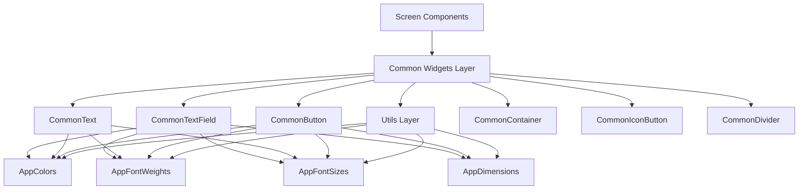
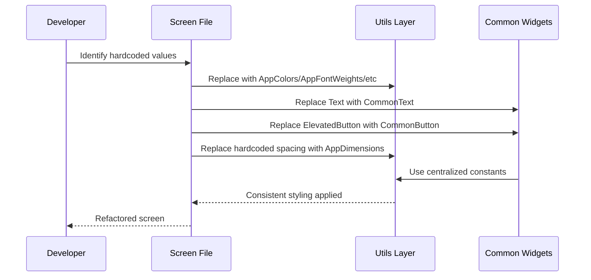
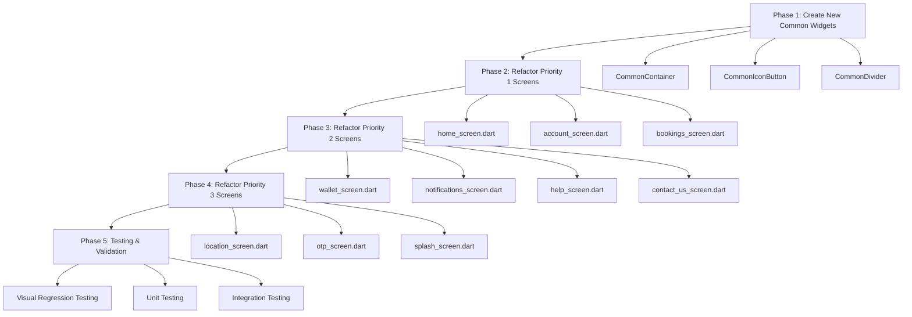

# Design Document: Flutter Hardcoded Values Refactoring

## Overview

This design document outlines a comprehensive refactoring strategy to eliminate hardcoded values across all screens in the Yes Madam Flutter application. The refactoring will enforce consistent usage of existing common utilities (AppColors, AppFontWeights, AppFontSizes, AppDimensions) and common widgets (CommonButton, CommonText, CommonTextField) throughout the codebase. This will improve maintainability, ensure design consistency, and enable easier theming and styling updates in the future.

## Architecture



## Main Refactoring Workflow



## Components and Interfaces

### Existing Common Utilities (Already Implemented)

#### 1. AppColors
**Purpose**: Centralized color palette for the entire application

**Available Colors**:
```dart
class AppColors {
  static const whiteColor = Color(0xFFFFFFFF);
  static const themeColor = Color(0xFFaf2d57);
  static const accentColor = Color(0xFFB06070);
  static Color greyColor = Colors.grey;
  static Color blackColor = Colors.black;
  static Color redAccentColor = Colors.redAccent;
  static const lightPinkColor = Color(0xFFFCE4EC);
  static Color primaryBlue = const Color(0xFF4087EC);
  static const pinkLight = Color(0xFFFCE4EC);
  static const pinkBackground = Color(0xFFFFF0F3);
  static const darkColor = Color(0xFF1A1A1A);
  static const greyLight = Color(0xFFF5F5F5);
  static const borderColor = Color(0xFFE0E0E0);
  static const goldColor = Color(0xFFFFB800);
  static const eliteBlack = Color(0xFF1A1A1A);
  static const disableButtonColor = Color(0xFFBCBCBC);
  static const textHintColor = Color(0xFF9E9E9E);
  static const lightGreyColor = Color(0xFFE0E0E0);
  static const inputBorderColor = Color(0xFFBDBDBD);
  static const errorColor = Color(0xFFF44336);
}
```

**Mapping Strategy**:
- `Colors.white` → `AppColors.whiteColor`
- `Colors.black87` → `AppColors.blackColor` or `AppColors.darkColor`
- `Colors.grey` → `AppColors.greyColor`
- `Colors.grey.shade100` → `AppColors.greyLight`
- `Colors.grey.shade200` → `AppColors.lightGreyColor`
- `Colors.grey.shade300` → `AppColors.borderColor`
- `Color(0xFFFFB6C1)` (pink) → `AppColors.lightPinkColor`
- `Color(0xFFF2F2F7)` (light grey) → `AppColors.greyLight`


#### 2. AppFontWeights
**Purpose**: Standardized font weights across the application

```dart
class AppFontWeights {
  static const FontWeight thin = FontWeight.w100;
  static const FontWeight extraLight = FontWeight.w200;
  static const FontWeight light = FontWeight.w300;
  static const FontWeight normal = FontWeight.w400;
  static const FontWeight medium = FontWeight.w500;
  static const FontWeight semiBold = FontWeight.w600;
  static const FontWeight bold = FontWeight.w700;
  static const FontWeight extraBold = FontWeight.w800;
  static const FontWeight black = FontWeight.w900;
  static const FontWeight regular = FontWeight.w400;
}
```

**Mapping Strategy**:
- `FontWeight.bold` → `AppFontWeights.bold`
- `FontWeight.w600` → `AppFontWeights.semiBold`
- `FontWeight.w500` → `AppFontWeights.medium`
- `FontWeight.normal` → `AppFontWeights.normal`

#### 3. AppFontSizes
**Purpose**: Consistent font sizing with responsive scaling

```dart
class AppFontSizes {
  static double fontSmall = 12.0.sp;
  static double fontMedium = 14.0.sp;
  static double fontXMedium = 16.0.sp;
  static double fontLarge = 20.0.sp;
  static double fontXLarge = 24.0.sp;
  static double fontXLarge26 = 26.0.sp;
  static double fontXLarge32 = 32.0.sp;
  static double fontXLarge36 = 36.0.sp;
  static double fontNenoSmall = 10.0.sp;
}
```


#### 4. AppDimensions
**Purpose**: Standardized spacing, padding, margins, and border radius

```dart
class AppDimensions {
  // Padding
  static double paddingSmall = 10.0;
  static double paddingMedium = 16.0;
  static double paddingXMedium = 20.0;
  static double paddingLarge = 24.0;
  static double paddingXLarge = 32.0;
  
  // Margin
  static const double marginSmall = 8.0;
  static const double marginMedium = 16.0;
  static const double marginLarge = 24.0;
  static const double marginXLarge = 32.0;
  
  // Spacing
  static const double spacingSmall = 4.0;
  static const double spacingMedium = 8.0;
  static const double spacingLarge = 12.0;
  static const double spacingXLarge = 16.0;
  
  // Border Radius
  static const double radiusSmall = 8.0;
  static const double radiusMedium = 12.0;
  static const double radiusLarge = 16.0;
  static const double radiusXLarge = 24.0;
  
  // Icon Sizes
  static const double iconSmall = 16.0;
  static const double iconMedium = 24.0;
  static const double iconLarge = 32.0;
}
```

**Mapping Strategy**:
- `BorderRadius.circular(8.r)` → `BorderRadius.circular(AppDimensions.radiusSmall.r)`
- `BorderRadius.circular(12.r)` → `BorderRadius.circular(AppDimensions.radiusMedium.r)`
- `SizedBox(height: 8.h)` → `SizedBox(height: AppDimensions.spacingMedium.h)`
- `SizedBox(height: 16.h)` → `SizedBox(height: AppDimensions.spacingXLarge.h)`


### Existing Common Widgets (Already Implemented)

#### 1. CommonText
**Purpose**: Standardized text widget with consistent styling

**Interface**:
```dart
class CommonText extends StatelessWidget {
  final String text;
  final double fontSize;
  final FontWeight fontWeight;
  final Color color;
  final TextAlign textAlign;
  final int? maxLines;
  final TextOverflow? overflow;
  final TextDecoration? decoration;
  
  const CommonText({
    required this.text,
    this.fontSize = 16,
    this.fontWeight = FontWeight.normal,
    this.color = AppColors.whiteColor,
    this.textAlign = TextAlign.start,
    this.maxLines,
    this.overflow,
    this.decoration,
  });
}
```

**Usage Pattern**:
```dart
// BEFORE (Hardcoded)
Text('Hello', style: TextStyle(fontSize: 14.sp, fontWeight: FontWeight.bold, color: Colors.black87))

// AFTER (Using CommonText)
CommonText(
  text: 'Hello',
  fontSize: AppFontSizes.fontMedium,
  fontWeight: AppFontWeights.bold,
  color: AppColors.blackColor,
)
```


#### 2. CommonButton
**Purpose**: Standardized button widget with consistent styling

**Interface**:
```dart
class CommonButton extends StatelessWidget {
  final String text;
  final VoidCallback? onPressed;
  final bool isEnabled;
  final double? height;
  final double? width;
  final double? fontSize;
  final FontWeight? fontWeight;
  final Widget? icon;
  final Color? backgroundColor;
  final Color? borderColor;
  final Color? textColor;
  
  const CommonButton({
    required this.text,
    this.onPressed,
    this.isEnabled = true,
    this.height,
    this.width,
    this.fontSize,
    this.fontWeight,
    this.icon,
    this.backgroundColor,
    this.borderColor,
    this.textColor,
  });
}
```

**Usage Pattern**:
```dart
// BEFORE (Hardcoded)
ElevatedButton(
  onPressed: () {},
  style: ElevatedButton.styleFrom(
    backgroundColor: Colors.black87,
    shape: RoundedRectangleBorder(borderRadius: BorderRadius.circular(6.r)),
  ),
  child: Text('Join Elite', style: TextStyle(color: Colors.white, fontSize: 11.sp)),
)

// AFTER (Using CommonButton)
CommonButton(
  text: 'Join Elite',
  onPressed: () {},
  backgroundColor: AppColors.darkColor,
  fontSize: AppFontSizes.fontSmall,
)
```


#### 3. CommonTextField
**Purpose**: Standardized text input field with consistent styling

**Interface**:
```dart
class CommonTextField extends StatefulWidget {
  final String? hintText;
  final String? labelText;
  final TextEditingController? controller;
  final ValueChanged<String>? onChanged;
  final TextInputType? keyboardType;
  final bool obscureText;
  final Widget? prefixIcon;
  final Widget? suffixIcon;
  final String? Function(String?)? validator;
  
  const CommonTextField({
    this.hintText,
    this.labelText,
    this.controller,
    this.onChanged,
    this.keyboardType,
    this.obscureText = false,
    this.prefixIcon,
    this.suffixIcon,
    this.validator,
  });
}
```

### New Common Widgets (To Be Created)

#### 4. CommonContainer
**Purpose**: Standardized container with consistent decoration patterns

**Interface**:
```dart
class CommonContainer extends StatelessWidget {
  final Widget child;
  final Color? backgroundColor;
  final double? borderRadius;
  final Color? borderColor;
  final double? borderWidth;
  final EdgeInsetsGeometry? padding;
  final EdgeInsetsGeometry? margin;
  final double? width;
  final double? height;
  final Gradient? gradient;
  
  const CommonContainer({
    required this.child,
    this.backgroundColor,
    this.borderRadius,
    this.borderColor,
    this.borderWidth,
    this.padding,
    this.margin,
    this.width,
    this.height,
    this.gradient,
  });
}
```


**Usage Pattern**:
```dart
// BEFORE (Hardcoded)
Container(
  padding: EdgeInsets.symmetric(horizontal: 12.w, vertical: 6.h),
  decoration: BoxDecoration(
    color: Colors.black87,
    borderRadius: BorderRadius.circular(20.r),
  ),
  child: Text('Elite'),
)

// AFTER (Using CommonContainer)
CommonContainer(
  padding: EdgeInsets.symmetric(
    horizontal: AppDimensions.paddingMedium.w,
    vertical: AppDimensions.spacingSmall.h,
  ),
  backgroundColor: AppColors.darkColor,
  borderRadius: AppDimensions.radiusXLarge,
  child: CommonText(text: 'Elite'),
)
```

#### 5. CommonIconButton
**Purpose**: Standardized icon button with consistent styling

**Interface**:
```dart
class CommonIconButton extends StatelessWidget {
  final IconData icon;
  final VoidCallback? onPressed;
  final Color? iconColor;
  final Color? backgroundColor;
  final double? iconSize;
  final double? buttonSize;
  final double? borderRadius;
  
  const CommonIconButton({
    required this.icon,
    this.onPressed,
    this.iconColor,
    this.backgroundColor,
    this.iconSize,
    this.buttonSize,
    this.borderRadius,
  });
}
```


**Usage Pattern**:
```dart
// BEFORE (Hardcoded)
GestureDetector(
  onTap: () => Get.back(),
  child: Container(
    width: 32.w,
    height: 32.w,
    decoration: const BoxDecoration(shape: BoxShape.circle, color: Colors.black87),
    child: Icon(Icons.close, color: Colors.white, size: 16.sp),
  ),
)

// AFTER (Using CommonIconButton)
CommonIconButton(
  icon: Icons.close,
  onPressed: () => Get.back(),
  backgroundColor: AppColors.darkColor,
  iconColor: AppColors.whiteColor,
  iconSize: AppDimensions.iconSmall,
  buttonSize: 32,
)
```

#### 6. CommonDivider
**Purpose**: Standardized divider with consistent styling

**Interface**:
```dart
class CommonDivider extends StatelessWidget {
  final Color? color;
  final double? thickness;
  final double? height;
  final EdgeInsetsGeometry? padding;
  
  const CommonDivider({
    this.color,
    this.thickness,
    this.height,
    this.padding,
  });
}
```

**Usage Pattern**:
```dart
// BEFORE (Hardcoded)
Padding(
  padding: EdgeInsets.symmetric(horizontal: 16.w),
  child: Divider(height: 1, color: Colors.grey.shade200),
)

// AFTER (Using CommonDivider)
CommonDivider(
  padding: EdgeInsets.symmetric(horizontal: AppDimensions.paddingMedium.w),
  color: AppColors.lightGreyColor,
)
```


## Algorithmic Pseudocode

### Main Refactoring Algorithm

```pascal
ALGORITHM refactorScreenFile(screenFilePath)
INPUT: screenFilePath (path to Flutter screen file)
OUTPUT: refactoredFile (updated screen file with common utilities)

BEGIN
  ASSERT fileExists(screenFilePath) = true
  
  // Step 1: Read the screen file
  fileContent ← readFile(screenFilePath)
  
  // Step 2: Replace hardcoded colors
  FOR each colorPattern IN hardcodedColorPatterns DO
    ASSERT colorPattern matches regex pattern
    
    replacement ← mapColorToAppColors(colorPattern)
    fileContent ← replaceAll(fileContent, colorPattern, replacement)
  END FOR
  
  // Step 3: Replace hardcoded font weights
  FOR each fontWeightPattern IN hardcodedFontWeightPatterns DO
    replacement ← mapFontWeightToAppFontWeights(fontWeightPattern)
    fileContent ← replaceAll(fileContent, fontWeightPattern, replacement)
  END FOR
  
  // Step 4: Replace Text widgets with CommonText
  FOR each textWidget IN findTextWidgets(fileContent) DO
    commonTextWidget ← convertToCommonText(textWidget)
    fileContent ← replace(fileContent, textWidget, commonTextWidget)
  END FOR
  
  // Step 5: Replace button widgets with CommonButton
  FOR each buttonWidget IN findButtonWidgets(fileContent) DO
    commonButtonWidget ← convertToCommonButton(buttonWidget)
    fileContent ← replace(fileContent, buttonWidget, commonButtonWidget)
  END FOR
  
  // Step 6: Replace hardcoded spacing with AppDimensions
  FOR each spacingPattern IN hardcodedSpacingPatterns DO
    replacement ← mapSpacingToAppDimensions(spacingPattern)
    fileContent ← replaceAll(fileContent, spacingPattern, replacement)
  END FOR
  
  // Step 7: Add necessary imports
  imports ← generateRequiredImports(fileContent)
  fileContent ← addImportsToFile(fileContent, imports)
  
  // Step 8: Write refactored file
  writeFile(screenFilePath, fileContent)
  
  ASSERT fileIsValid(screenFilePath) = true
  
  RETURN fileContent
END
```

**Preconditions**:
- screenFilePath is a valid Flutter Dart file
- File has read/write permissions
- Common utilities (AppColors, AppFontWeights, etc.) are available in the project

**Postconditions**:
- All hardcoded colors replaced with AppColors references
- All hardcoded font weights replaced with AppFontWeights references
- All Text widgets replaced with CommonText widgets
- All button widgets replaced with CommonButton widgets
- All hardcoded spacing replaced with AppDimensions references
- File compiles without errors

**Loop Invariants**:
- File content remains valid Dart syntax throughout all replacements
- All previous replacements remain intact during subsequent iterations


### Color Mapping Algorithm

```pascal
ALGORITHM mapColorToAppColors(colorPattern)
INPUT: colorPattern (hardcoded color string)
OUTPUT: appColorReference (AppColors constant reference)

BEGIN
  // Define color mapping table
  colorMap ← {
    "Colors.white": "AppColors.whiteColor",
    "Colors.black87": "AppColors.blackColor",
    "Colors.black": "AppColors.blackColor",
    "Colors.grey": "AppColors.greyColor",
    "Colors.grey.shade100": "AppColors.greyLight",
    "Colors.grey.shade200": "AppColors.lightGreyColor",
    "Colors.grey.shade300": "AppColors.borderColor",
    "Color(0xFFFFB6C1)": "AppColors.lightPinkColor",
    "Color(0xFFF2F2F7)": "AppColors.greyLight",
    "Color(0xFF87CEEB)": "AppColors.primaryBlue",
    "Color(0xFF4CAF50)": "Colors.green",
    "Color(0xFFFFF8DC)": "AppColors.pinkBackground",
    "Color(0xFFFFF0C0)": "AppColors.pinkBackground"
  }
  
  // Check if pattern exists in map
  IF colorPattern IN colorMap THEN
    RETURN colorMap[colorPattern]
  ELSE
    // Log warning for unmapped color
    logWarning("Unmapped color found: " + colorPattern)
    RETURN colorPattern
  END IF
END
```

**Preconditions**:
- colorPattern is a valid Dart color expression

**Postconditions**:
- Returns AppColors reference if mapping exists
- Returns original pattern if no mapping found
- Warning logged for unmapped colors


### Text Widget Conversion Algorithm

```pascal
ALGORITHM convertToCommonText(textWidget)
INPUT: textWidget (Text widget AST node)
OUTPUT: commonTextWidget (CommonText widget string)

BEGIN
  // Extract properties from Text widget
  textContent ← extractTextContent(textWidget)
  textStyle ← extractTextStyle(textWidget)
  textAlign ← extractTextAlign(textWidget)
  maxLines ← extractMaxLines(textWidget)
  overflow ← extractOverflow(textWidget)
  
  // Extract style properties
  IF textStyle IS NOT NULL THEN
    fontSize ← extractFontSize(textStyle)
    fontWeight ← extractFontWeight(textStyle)
    color ← extractColor(textStyle)
    
    // Map to AppFontSizes and AppFontWeights
    fontSize ← mapToAppFontSizes(fontSize)
    fontWeight ← mapToAppFontWeights(fontWeight)
    color ← mapToAppColors(color)
  END IF
  
  // Build CommonText widget
  commonTextWidget ← "CommonText(\n"
  commonTextWidget ← commonTextWidget + "  text: '" + textContent + "',\n"
  
  IF fontSize IS NOT NULL THEN
    commonTextWidget ← commonTextWidget + "  fontSize: " + fontSize + ",\n"
  END IF
  
  IF fontWeight IS NOT NULL THEN
    commonTextWidget ← commonTextWidget + "  fontWeight: " + fontWeight + ",\n"
  END IF
  
  IF color IS NOT NULL THEN
    commonTextWidget ← commonTextWidget + "  color: " + color + ",\n"
  END IF
  
  IF textAlign IS NOT NULL THEN
    commonTextWidget ← commonTextWidget + "  textAlign: " + textAlign + ",\n"
  END IF
  
  IF maxLines IS NOT NULL THEN
    commonTextWidget ← commonTextWidget + "  maxLines: " + maxLines + ",\n"
  END IF
  
  IF overflow IS NOT NULL THEN
    commonTextWidget ← commonTextWidget + "  overflow: " + overflow + ",\n"
  END IF
  
  commonTextWidget ← commonTextWidget + ")"
  
  RETURN commonTextWidget
END
```

**Preconditions**:
- textWidget is a valid Text widget AST node
- Text widget has at least a text content

**Postconditions**:
- Returns valid CommonText widget string
- All style properties mapped to common utilities
- Widget maintains same visual appearance


## Key Functions with Formal Specifications

### Function 1: refactorScreen()

```dart
Future<void> refactorScreen(String screenPath)
```

**Preconditions:**
- `screenPath` is a valid file path to a Flutter screen file
- File exists and has read/write permissions
- Common utilities are available in the project

**Postconditions:**
- All hardcoded values replaced with common utility references
- File compiles without errors
- Visual appearance remains unchanged
- No side effects on other files

**Loop Invariants:** N/A (uses helper functions)

### Function 2: replaceHardcodedColors()

```dart
String replaceHardcodedColors(String fileContent)
```

**Preconditions:**
- `fileContent` is valid Dart code string
- fileContent is non-empty

**Postconditions:**
- Returns modified string with all hardcoded colors replaced
- Original fileContent remains unchanged (immutable)
- All color references point to AppColors constants

**Loop Invariants:**
- For color replacement loops: All previously replaced colors remain valid

### Function 3: replaceTextWidgets()

```dart
String replaceTextWidgets(String fileContent)
```

**Preconditions:**
- `fileContent` is valid Dart code string
- Text widgets follow standard Flutter syntax

**Postconditions:**
- Returns modified string with all Text widgets replaced by CommonText
- Widget properties correctly mapped to CommonText parameters
- Visual rendering remains identical

**Loop Invariants:**
- All previously converted widgets remain syntactically valid


## Screen-by-Screen Refactoring Strategy

### Priority 1: Heavily Hardcoded Screens (High Impact)

#### 1. home_screen.dart
**Hardcoded Issues**:
- Colors: `Colors.white`, `Colors.black87`, `Colors.grey`, `Color(0xFFFFB6C1)`, `Color(0xFFFF9999)`, `Color(0xFFFFF8F0)`
- Font Weights: `FontWeight.bold`, inline in TextStyle
- Text Widgets: Multiple `Text()` widgets with inline styles
- Spacing: Hardcoded `SizedBox` values (8.h, 12.h, 16.h, 20.h)
- Border Radius: Hardcoded `BorderRadius.circular()` values (8.r, 12.r, 20.r)
- Containers: Multiple containers with hardcoded decorations

**Refactoring Steps**:
1. Replace all `Colors.white` with `AppColors.whiteColor`
2. Replace all `Colors.black87` with `AppColors.blackColor`
3. Replace all `Colors.grey` with `AppColors.greyColor`
4. Replace all `Text()` widgets with `CommonText()`
5. Replace hardcoded spacing with `AppDimensions` constants
6. Replace hardcoded border radius with `AppDimensions.radius*`
7. Add missing imports for common utilities

**Estimated Lines Changed**: ~150 lines

#### 2. account_screen.dart
**Hardcoded Issues**:
- Colors: `Color(0xFFF2F2F7)`, `Colors.white`, `Colors.black87`, `Colors.grey`
- Font Weights: Multiple `FontWeight.bold`, `FontWeight.black`
- Text Widgets: Extensive use of `Text()` with inline styles
- Buttons: `ElevatedButton` with hardcoded styles
- Spacing: Hardcoded padding and margin values
- Containers: Multiple containers with hardcoded decorations

**Refactoring Steps**:
1. Replace background color `Color(0xFFF2F2F7)` with `AppColors.greyLight`
2. Replace all `Text()` widgets with `CommonText()`
3. Replace `ElevatedButton` with `CommonButton`
4. Replace hardcoded spacing with `AppDimensions`
5. Create reusable components for repeated patterns (menu items, quick actions)

**Estimated Lines Changed**: ~180 lines


#### 3. bookings_screen.dart
**Hardcoded Issues**:
- Colors: `Colors.white`, `Colors.black87`, `Colors.grey`, `Color(0xFF87CEEB)`, `Color(0xFF1E5FA8)`, `Color(0xFF4CAF50)`
- Font Weights: `FontWeight.bold`, `FontWeight.semiBold`
- Text Widgets: Multiple `Text()` widgets
- Buttons: `TextButton` with hardcoded styles
- Spacing: Hardcoded `SizedBox` values
- Containers: Tab containers with hardcoded decorations

**Refactoring Steps**:
1. Replace all hardcoded colors with `AppColors` equivalents
2. Replace all `Text()` widgets with `CommonText()`
3. Replace `TextButton` with `CommonButton`
4. Replace hardcoded spacing with `AppDimensions`
5. Refactor tab item widget to use common utilities

**Estimated Lines Changed**: ~120 lines

### Priority 2: Medium Hardcoded Screens

#### 4. wallet_screen.dart
**Refactoring Steps**:
1. Replace hardcoded colors with `AppColors`
2. Replace `Text()` widgets with `CommonText()`
3. Replace hardcoded spacing with `AppDimensions`

**Estimated Lines Changed**: ~80 lines

#### 5. notifications_screen.dart
**Refactoring Steps**:
1. Replace hardcoded colors with `AppColors`
2. Replace `Text()` widgets with `CommonText()`
3. Replace hardcoded spacing with `AppDimensions`

**Estimated Lines Changed**: ~70 lines

#### 6. help_screen.dart
**Refactoring Steps**:
1. Replace hardcoded colors with `AppColors`
2. Replace `Text()` widgets with `CommonText()`
3. Replace hardcoded spacing with `AppDimensions`

**Estimated Lines Changed**: ~60 lines

#### 7. contact_us_screen.dart
**Refactoring Steps**:
1. Replace hardcoded colors with `AppColors`
2. Replace `Text()` widgets with `CommonText()`
3. Replace `CommonTextField` usage (already using common widget)
4. Replace hardcoded spacing with `AppDimensions`

**Estimated Lines Changed**: ~50 lines


### Priority 3: Low Hardcoded Screens

#### 8. location_screen.dart
**Refactoring Steps**:
1. Replace hardcoded colors with `AppColors`
2. Replace `Text()` widgets with `CommonText()`
3. Replace hardcoded spacing with `AppDimensions`

**Estimated Lines Changed**: ~40 lines

#### 9. otp_screen.dart
**Refactoring Steps**:
1. Replace hardcoded colors with `AppColors`
2. Replace `Text()` widgets with `CommonText()`
3. Replace hardcoded spacing with `AppDimensions`

**Estimated Lines Changed**: ~40 lines

#### 10. splash_screen.dart
**Refactoring Steps**:
1. Replace hardcoded colors with `AppColors`
2. Replace `Text()` widgets with `CommonText()`
3. Replace hardcoded spacing with `AppDimensions`

**Estimated Lines Changed**: ~30 lines

## Refactoring Execution Order




## Code Patterns and Conventions

### Pattern 1: Color Replacement

**BEFORE**:
```dart
Container(
  color: Colors.white,
  child: Text('Hello', style: TextStyle(color: Colors.black87)),
)
```

**AFTER**:
```dart
Container(
  color: AppColors.whiteColor,
  child: CommonText(
    text: 'Hello',
    color: AppColors.blackColor,
  ),
)
```

### Pattern 2: Text Widget Replacement

**BEFORE**:
```dart
Text(
  'Welcome',
  style: TextStyle(
    fontSize: 18.sp,
    fontWeight: FontWeight.bold,
    color: Colors.black87,
  ),
)
```

**AFTER**:
```dart
CommonText(
  text: 'Welcome',
  fontSize: AppFontSizes.fontLarge,
  fontWeight: AppFontWeights.bold,
  color: AppColors.blackColor,
)
```

### Pattern 3: Button Replacement

**BEFORE**:
```dart
ElevatedButton(
  onPressed: () {},
  style: ElevatedButton.styleFrom(
    backgroundColor: AppColors.accentColor,
    shape: RoundedRectangleBorder(
      borderRadius: BorderRadius.circular(8.r),
    ),
  ),
  child: Text('Submit', style: TextStyle(color: Colors.white)),
)
```

**AFTER**:
```dart
CommonButton(
  text: 'Submit',
  onPressed: () {},
  backgroundColor: AppColors.accentColor,
)
```


### Pattern 4: Spacing Replacement

**BEFORE**:
```dart
Column(
  children: [
    Widget1(),
    SizedBox(height: 8.h),
    Widget2(),
    SizedBox(height: 16.h),
    Widget3(),
  ],
)
```

**AFTER**:
```dart
Column(
  children: [
    Widget1(),
    SizedBox(height: AppDimensions.spacingMedium.h),
    Widget2(),
    SizedBox(height: AppDimensions.spacingXLarge.h),
    Widget3(),
  ],
)
```

### Pattern 5: Container Decoration Replacement

**BEFORE**:
```dart
Container(
  padding: EdgeInsets.all(16.w),
  decoration: BoxDecoration(
    color: Colors.white,
    borderRadius: BorderRadius.circular(12.r),
    border: Border.all(color: Colors.grey.shade300),
  ),
  child: child,
)
```

**AFTER**:
```dart
CommonContainer(
  padding: EdgeInsets.all(AppDimensions.paddingMedium.w),
  backgroundColor: AppColors.whiteColor,
  borderRadius: AppDimensions.radiusMedium,
  borderColor: AppColors.borderColor,
  borderWidth: 1,
  child: child,
)
```

### Pattern 6: RichText Replacement

**BEFORE**:
```dart
RichText(
  text: TextSpan(
    style: TextStyle(fontSize: 12.sp),
    children: [
      TextSpan(text: 'Get ', style: TextStyle(color: Colors.white)),
      TextSpan(text: '10% OFF', style: TextStyle(color: AppColors.goldColor, fontWeight: FontWeight.bold)),
    ],
  ),
)
```

**AFTER**:
```dart
RichText(
  text: TextSpan(
    style: TextStyle(fontSize: AppFontSizes.fontSmall),
    children: [
      TextSpan(text: 'Get ', style: TextStyle(color: AppColors.whiteColor)),
      TextSpan(
        text: '10% OFF',
        style: TextStyle(
          color: AppColors.goldColor,
          fontWeight: AppFontWeights.bold,
        ),
      ),
    ],
  ),
)
```


## Missing Color Mappings (To Be Added to AppColors)

Based on the analysis of hardcoded values, the following colors need to be added to `AppColors`:

```dart
// Add to AppColors class
static const Color backgroundGrey = Color(0xFFF2F2F7);
static const Color lightBlue = Color(0xFF87CEEB);
static const Color darkBlue = Color(0xFF1E5FA8);
static const Color successGreen = Color(0xFF4CAF50);
static const Color pinkGradientStart = Color(0xFFFFB6C1);
static const Color pinkGradientEnd = Color(0xFFFF9999);
static const Color creamBackground = Color(0xFFFFF8F0);
static const Color yellowGradientStart = Color(0xFFFFF8DC);
static const Color yellowGradientEnd = Color(0xFFFFF0C0);
static const Color orangeColor = Colors.orange;
static const Color greenColor = Colors.green;
```

## Example Usage

### Before Refactoring (home_screen.dart excerpt)

```dart
Container(
  height: 180.h,
  decoration: BoxDecoration(
    borderRadius: BorderRadius.circular(12.r),
    gradient: const LinearGradient(
      colors: [Color(0xFFFFB6C1), Color(0xFFFF9999)],
    ),
  ),
  child: Padding(
    padding: EdgeInsets.all(16.w),
    child: Column(
      crossAxisAlignment: CrossAxisAlignment.start,
      children: [
        Text(
          '₹200 Off',
          style: TextStyle(
            fontSize: 28.sp,
            fontWeight: FontWeight.w800,
            color: AppColors.accentColor,
          ),
        ),
        Text(
          'on your first booking',
          style: TextStyle(
            fontSize: 14.sp,
            color: AppColors.accentColor,
            fontWeight: FontWeight.w600,
          ),
        ),
      ],
    ),
  ),
)
```


### After Refactoring (home_screen.dart excerpt)

```dart
CommonContainer(
  height: 180.h,
  borderRadius: AppDimensions.radiusMedium,
  gradient: const LinearGradient(
    colors: [AppColors.pinkGradientStart, AppColors.pinkGradientEnd],
  ),
  padding: EdgeInsets.all(AppDimensions.paddingMedium.w),
  child: Column(
    crossAxisAlignment: CrossAxisAlignment.start,
    children: [
      CommonText(
        text: '₹200 Off',
        fontSize: AppFontSizes.fontXLarge26,
        fontWeight: AppFontWeights.extraBold,
        color: AppColors.accentColor,
      ),
      CommonText(
        text: 'on your first booking',
        fontSize: AppFontSizes.fontMedium,
        color: AppColors.accentColor,
        fontWeight: AppFontWeights.semiBold,
      ),
    ],
  ),
)
```

## Correctness Properties

### Property 1: Color Consistency
**Universal Quantification**: ∀ screen ∈ Screens, ∀ color ∈ screen.colors → color ∈ AppColors

**Meaning**: For all screens in the application, all colors used must be defined in AppColors utility class.

### Property 2: Font Weight Consistency
**Universal Quantification**: ∀ screen ∈ Screens, ∀ fontWeight ∈ screen.fontWeights → fontWeight ∈ AppFontWeights

**Meaning**: For all screens in the application, all font weights used must be defined in AppFontWeights utility class.

### Property 3: Text Widget Replacement
**Universal Quantification**: ∀ screen ∈ Screens, ∀ textWidget ∈ screen.widgets → textWidget.type = CommonText

**Meaning**: For all screens in the application, all text widgets must use CommonText instead of Flutter's default Text widget.

### Property 4: Button Widget Replacement
**Universal Quantification**: ∀ screen ∈ Screens, ∀ button ∈ screen.buttons → button.type = CommonButton

**Meaning**: For all screens in the application, all button widgets must use CommonButton instead of Flutter's default button widgets.

### Property 5: Spacing Consistency
**Universal Quantification**: ∀ screen ∈ Screens, ∀ spacing ∈ screen.spacings → spacing ∈ AppDimensions

**Meaning**: For all screens in the application, all spacing values must be defined in AppDimensions utility class.


### Property 6: Visual Equivalence
**Universal Quantification**: ∀ screen ∈ Screens → visualAppearance(screen_before) = visualAppearance(screen_after)

**Meaning**: For all screens in the application, the visual appearance before and after refactoring must remain identical.

### Property 7: No Compilation Errors
**Universal Quantification**: ∀ screen ∈ RefactoredScreens → compiles(screen) = true

**Meaning**: All refactored screens must compile without errors.

## Error Handling

### Error Scenario 1: Missing Color Mapping

**Condition**: A hardcoded color is found that doesn't have a corresponding AppColors constant

**Response**: 
1. Log warning with color value and location
2. Add color to AppColors with descriptive name
3. Update refactoring script to use new color constant

**Recovery**: Manual review and addition of missing color to AppColors

### Error Scenario 2: Complex Text Widget

**Condition**: Text widget has complex styling that cannot be directly mapped to CommonText

**Response**:
1. Keep original Text widget temporarily
2. Log for manual review
3. Consider extending CommonText to support the use case

**Recovery**: Manual refactoring or CommonText enhancement

### Error Scenario 3: Custom Button Styling

**Condition**: Button has custom styling that CommonButton doesn't support

**Response**:
1. Keep original button widget temporarily
2. Log for manual review
3. Consider extending CommonButton or creating specialized button widget

**Recovery**: Manual refactoring or CommonButton enhancement

### Error Scenario 4: Compilation Error After Refactoring

**Condition**: Refactored screen fails to compile

**Response**:
1. Revert changes to last working state
2. Analyze error message
3. Fix issue manually
4. Update refactoring script to handle similar cases

**Recovery**: Manual fix and script improvement


## Testing Strategy

### Unit Testing Approach

**Test Coverage Goals**:
- 100% coverage for new common widgets (CommonContainer, CommonIconButton, CommonDivider)
- Test all color mappings in AppColors
- Test all font weight mappings in AppFontWeights
- Test all dimension mappings in AppDimensions

**Key Test Cases**:

1. **CommonContainer Tests**:
   - Test default styling
   - Test custom background color
   - Test border radius application
   - Test border color and width
   - Test padding and margin
   - Test gradient application

2. **CommonIconButton Tests**:
   - Test default styling
   - Test custom icon color
   - Test custom background color
   - Test icon size
   - Test button size
   - Test onPressed callback

3. **CommonDivider Tests**:
   - Test default styling
   - Test custom color
   - Test custom thickness
   - Test padding application

4. **Color Mapping Tests**:
   - Test all AppColors constants are valid Color objects
   - Test color values match design specifications

5. **Font Weight Mapping Tests**:
   - Test all AppFontWeights constants are valid FontWeight objects
   - Test font weight values match design specifications

### Property-Based Testing Approach

**Property Test Library**: Not applicable for this refactoring (visual/UI focused)

### Integration Testing Approach

**Test Strategy**:
- Visual regression testing for each refactored screen
- Compare screenshots before and after refactoring
- Ensure pixel-perfect match

**Test Cases**:

1. **Screen Rendering Tests**:
   - Test each refactored screen renders without errors
   - Test all widgets are displayed correctly
   - Test responsive behavior on different screen sizes

2. **Navigation Tests**:
   - Test navigation between screens works correctly
   - Test back button functionality
   - Test deep linking (if applicable)

3. **Interaction Tests**:
   - Test button clicks work correctly
   - Test text input works correctly
   - Test scroll behavior works correctly


### Visual Regression Testing

**Tools**: 
- Flutter Golden Tests
- Screenshot comparison tools

**Process**:
1. Capture golden screenshots of all screens before refactoring
2. Refactor screens
3. Capture new screenshots after refactoring
4. Compare screenshots pixel-by-pixel
5. Flag any visual differences for manual review

**Acceptance Criteria**:
- 100% visual match for all screens
- No pixel differences in layout, colors, fonts, or spacing

## Performance Considerations

### Performance Goals

1. **Build Time**: Refactoring should not increase build time
2. **Runtime Performance**: No performance degradation in screen rendering
3. **Memory Usage**: No increase in memory footprint

### Optimization Strategies

1. **Const Constructors**: Use const constructors wherever possible for common widgets
2. **Widget Caching**: Cache commonly used widget instances
3. **Lazy Loading**: Ensure screens are still lazy-loaded

### Performance Metrics

**Before Refactoring**:
- Measure average screen render time
- Measure memory usage per screen
- Measure app startup time

**After Refactoring**:
- Compare metrics to ensure no degradation
- Target: <5% variance in all metrics

## Security Considerations

### Security Requirements

1. **No Sensitive Data Exposure**: Ensure refactoring doesn't accidentally expose sensitive data
2. **Input Validation**: Maintain existing input validation in CommonTextField
3. **Access Control**: Maintain existing access control logic

### Security Testing

1. **Code Review**: Review all refactored code for security issues
2. **Static Analysis**: Run static analysis tools to detect potential vulnerabilities
3. **Penetration Testing**: Perform basic penetration testing on refactored screens


## Dependencies

### Existing Dependencies (Already in Project)

1. **flutter**: Flutter SDK
2. **flutter_screenutil**: Responsive UI library (already used with .sp, .w, .h extensions)
3. **get**: State management and navigation (already used in screens)

### New Dependencies (None Required)

No new dependencies are required for this refactoring. All work will be done using existing Flutter and project utilities.

### Internal Dependencies

1. **lib/utils/app_colors.dart**: Color constants
2. **lib/utils/app_font_weights.dart**: Font weight constants
3. **lib/utils/app_font_sizes.dart**: Font size constants
4. **lib/utils/app_dimensions.dart**: Spacing and dimension constants
5. **lib/widgets/common/common_text.dart**: Common text widget
6. **lib/widgets/common/common_button.dart**: Common button widget
7. **lib/widgets/common/common_text_field.dart**: Common text field widget

### New Files to Create

1. **lib/widgets/common/common_container.dart**: Common container widget
2. **lib/widgets/common/common_icon_button.dart**: Common icon button widget
3. **lib/widgets/common/common_divider.dart**: Common divider widget

## Implementation Phases

### Phase 1: Preparation (1 day)
1. Create new common widgets (CommonContainer, CommonIconButton, CommonDivider)
2. Add missing colors to AppColors
3. Write unit tests for new common widgets
4. Set up visual regression testing framework

### Phase 2: Priority 1 Screens (2-3 days)
1. Refactor home_screen.dart
2. Refactor account_screen.dart
3. Refactor bookings_screen.dart
4. Run visual regression tests
5. Fix any issues

### Phase 3: Priority 2 Screens (2 days)
1. Refactor wallet_screen.dart
2. Refactor notifications_screen.dart
3. Refactor help_screen.dart
4. Refactor contact_us_screen.dart
5. Run visual regression tests
6. Fix any issues

### Phase 4: Priority 3 Screens (1 day)
1. Refactor location_screen.dart
2. Refactor otp_screen.dart
3. Refactor splash_screen.dart
4. Run visual regression tests
5. Fix any issues

### Phase 5: Testing & Validation (1-2 days)
1. Run full test suite
2. Perform manual testing on all screens
3. Fix any remaining issues
4. Code review
5. Documentation update

**Total Estimated Time**: 7-9 days


## Refactoring Checklist

### Pre-Refactoring Checklist
- [ ] Create CommonContainer widget
- [ ] Create CommonIconButton widget
- [ ] Create CommonDivider widget
- [ ] Add missing colors to AppColors
- [ ] Write unit tests for new widgets
- [ ] Set up visual regression testing
- [ ] Create backup branch in version control

### Per-Screen Refactoring Checklist
- [ ] Identify all hardcoded colors
- [ ] Identify all hardcoded font weights
- [ ] Identify all Text widgets
- [ ] Identify all button widgets
- [ ] Identify all hardcoded spacing values
- [ ] Identify all hardcoded border radius values
- [ ] Replace colors with AppColors
- [ ] Replace font weights with AppFontWeights
- [ ] Replace Text with CommonText
- [ ] Replace buttons with CommonButton
- [ ] Replace spacing with AppDimensions
- [ ] Replace border radius with AppDimensions
- [ ] Add necessary imports
- [ ] Remove unused imports
- [ ] Run flutter analyze
- [ ] Run flutter test
- [ ] Run visual regression test
- [ ] Manual testing
- [ ] Code review

### Post-Refactoring Checklist
- [ ] All screens refactored
- [ ] All tests passing
- [ ] Visual regression tests passing
- [ ] No compilation errors
- [ ] No runtime errors
- [ ] Performance metrics acceptable
- [ ] Code review completed
- [ ] Documentation updated
- [ ] Merge to main branch

## Success Criteria

1. **Zero Hardcoded Values**: No hardcoded colors, font weights, or spacing values in any screen
2. **100% Common Widget Usage**: All Text widgets replaced with CommonText, all buttons with CommonButton
3. **Visual Equivalence**: All screens look identical before and after refactoring
4. **No Compilation Errors**: All code compiles without errors
5. **No Runtime Errors**: All screens render without errors
6. **Test Coverage**: 100% test coverage for new common widgets
7. **Performance**: No performance degradation (< 5% variance)
8. **Code Quality**: All code passes flutter analyze with no warnings
